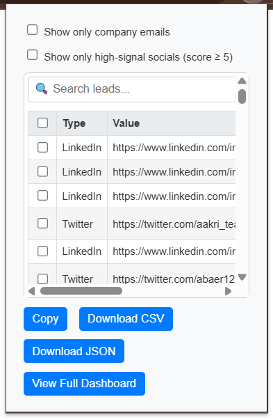
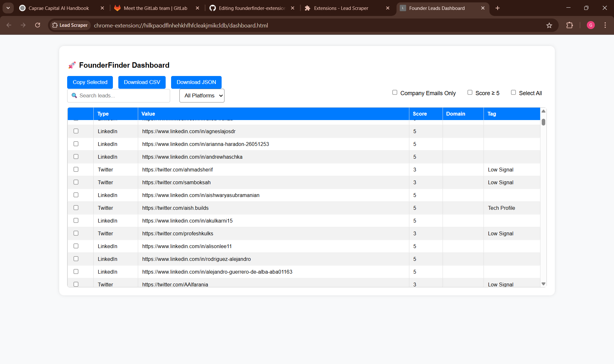

# 🚀 FounderFinder – Chrome Extension for Lead Discovery

FounderFinder is a lightweight and powerful Chrome Extension that scrapes emails and social profile links (LinkedIn, Twitter, GitHub, AngelList) from any webpage and scores them based on relevance to identify high-quality startup leads (e.g., founders, CEOs, developers).

---

## 📌 Features

- 🔍 **Auto-detects** emails and social profile links from any open webpage
- 🧠 **Smart scoring & tagging** (e.g., "Founder Email", "Tech Profile")
- ✅ **Filters:** Show only company emails or high-signal leads (Score ≥ 5)
- 📋 **Dashboard View** + CSV / JSON export
- 🖱️ **Copy** selected rows to clipboard
- 📂 **Works on most** startup/portfolio/repository pages
- ⚡ **Lightweight**, no login required

---
## 📸 Screenshots

### 🔍 Popup UI


### 📊 Dashboard View


---

## 🔧 Setup Instructions

1. **Clone the repository:**
git clone https://github.com/Ganesh-0509/founderfinder-extension.git


---

## 🛠️ Installation

1. Open Chrome and go to `chrome://extensions/`
2. Enable **Developer Mode** (toggle in the top-right corner)
3. Click **“Load unpacked”**
4. Select your project folder (where `manifest.json` is located)

---

## 🚀 How to Use

1. Visit any webpage (e.g., LinkedIn, GitHub, startup directory)
2. Click the **FounderFinder** Chrome Extension icon
3. The popup will show detected emails and social profiles
4. Use the filters to refine leads
5. Click **“Copy”, “Download CSV/JSON”**, or **“View Full Dashboard”**
6. On the full dashboard, you can:
- Search, filter, and sort leads
- Score founders automatically
- Export selected leads

---

## 🗂️ File Structure

```
founderfinder-extension/
│
├── manifest.json # Chrome extension config
├── content.js # Scraper logic
├── popup.html / popup.js # Mini UI inside Chrome popup
├── dashboard.html / dashboard.js # Full-screen dashboard
├── icon.png # Browser icon
├── README.md # This file
└── ... (screenshots / assets)

```
---

## 📊 Lead Scoring Logic

- Emails with business domains (non-Gmail) and terms like `ceo`, `founder`, etc. are scored higher.
- LinkedIn, Twitter, GitHub profiles are tagged if keywords like `startup`, `build`, or `tech` are detected.
- Signals help prioritize decision-makers and real founders.

---

## 🔐 Chrome Permissions

The following permissions are required for the extension to function:

"permissions": ["activeTab", "scripting", "storage"],
"host_permissions": ["<all_urls>"]


---

## ✅ Technologies Used

- Vanilla JavaScript
- HTML & CSS
- Chrome Extension APIs:
  - `chrome.storage`
  - `chrome.runtime`
  - `chrome.tabs`
  - `chrome.scripting`

---

## ⚠️ License & Disclaimer

This project is licensed under the [MIT License](./LICENSE).  
© 2025 Ganesh Kumar T. All rights reserved.

This Chrome Extension was built as part of the Caprae Capital Internship Challenge 2025.  
Any reproduction, redistribution, or reuse of the codebase must include proper attribution.

Plagiarism or unauthorized publication of this work without credit will be considered a violation of this license and may result in academic or legal consequences.
